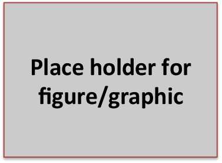

# Introduction

The high-level description of PMIx examples goes here.

The Figure :numref:`pmixexamples:introduction:dummyfigure` is a placeholder.
We also have :ref:`pmixexamples:introduction` as another reference type.

